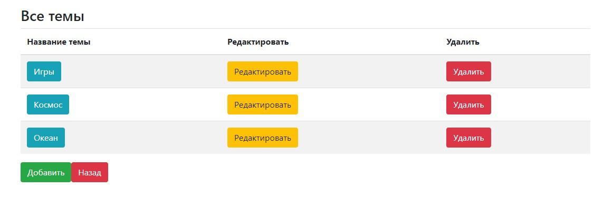
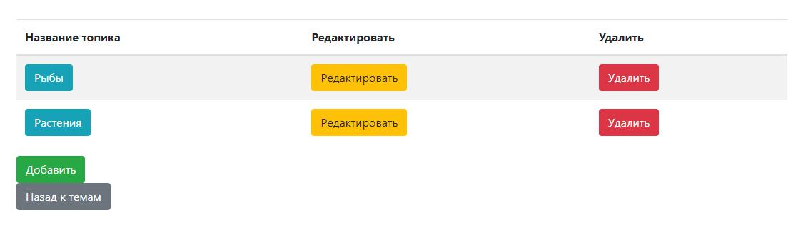
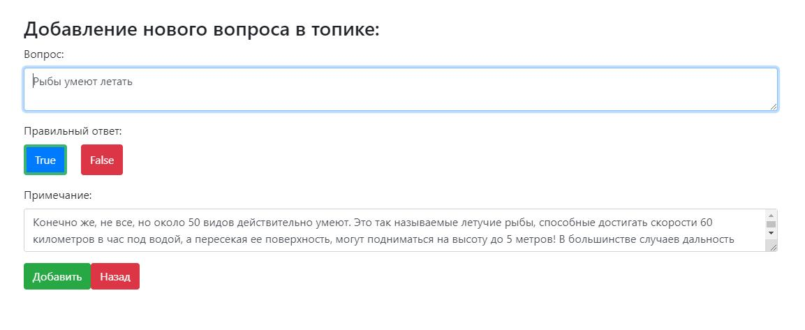

# Пример игры на Java Spring Boot с использованием PostgreSQL и Vue.js

Данный проект представляет собой простую реализацию игры "верю - не верю" на базе Spring Boot, PostgreSQL и Vue.js.

Он обеспечивает взаимодействие между фронтендом и бэкендом с помощью контроллеров Axios.

Фронтенд и бэкенд общаются на порту 5000, работая независимо друг от друга. Проект удобно запускать как из среды разработки IntelliJ IDEA, так и с использованием Docker.

## Инструкции:

### Скачивание или клонирование проекта

### Запуск из IntelliJ IDEA:
#### Бэкенд:
- `mvn clean install`
- `mvn spring-boot:run`
  или просто запустите `GameBackEnd`

#### Фронтенд:
- Откройте терминал
- Перейдите в директорию `frontend`
- `npm install` (при первом запуске)
- `npm run serve`

### Запуск с помощью Docker:
- `docker-compose up`
  или
- Запустите `docker-compose.yml`

## Описание:
Приложение состоит из двух основных частей: Игры и Административной секции.

Через административную секцию можно создавать темы -> подтемы -> вопросы к темам.
*(Поле Примечание: необязателен)*

### Скриншоты:

Игра подсчитывает количество правильных и неправильных ответов. По завершении всех вопросов отображается общий процент правильных ответов.

# Java Spring Boot PostgreSQL to Vue Game Example

This project is a simple implementation of a quiz game based on Spring Boot, PostgreSQL, and Vue.js.

It implements the communication between frontend and backend using Axios controllers.

The Frontend and Backend communicate on port 5000 independently of each other. It can be conveniently run directly from IntelliJ IDEA or using Docker.

## Instructions:

### Download or Clone the Project

### Running in IntelliJ IDEA:
#### Backend:
- `mvn clean install`
- `mvn spring-boot:run`
  or simply run `GameBackEnd`

#### Frontend:
- Open terminal
- Navigate to the `frontend` directory
- `npm install` (for first run)
- `npm run serve`

### Running with Docker:
- `docker-compose up`
  or
- Run `docker-compose.yml`

## Description:
The application consists of two main parts: the Game and the Administrative section.

Through the administrative section, create topics -> subtopics -> questions for the topics.
*(Fields Note: is optional)*

### Screenshots:

The game calculates the number of correct and incorrect answers. After finishing all the questions, it displays the overall percentage of correct answers.

